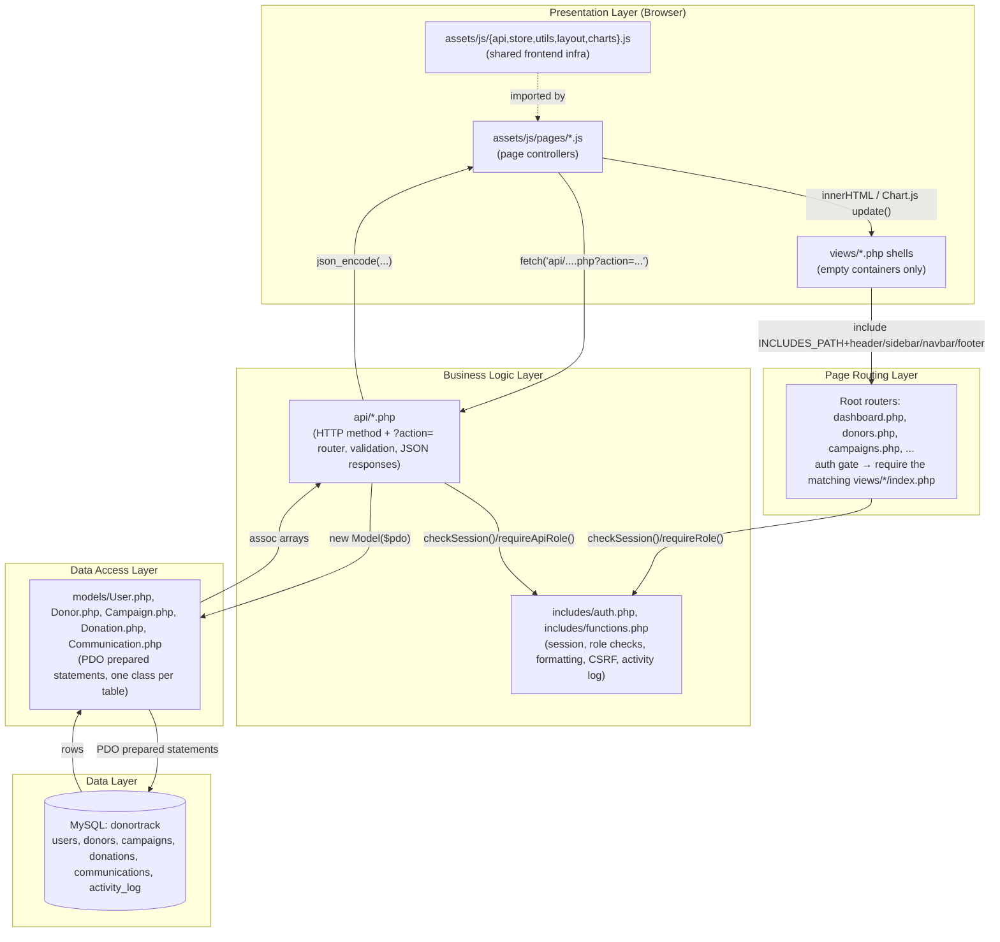
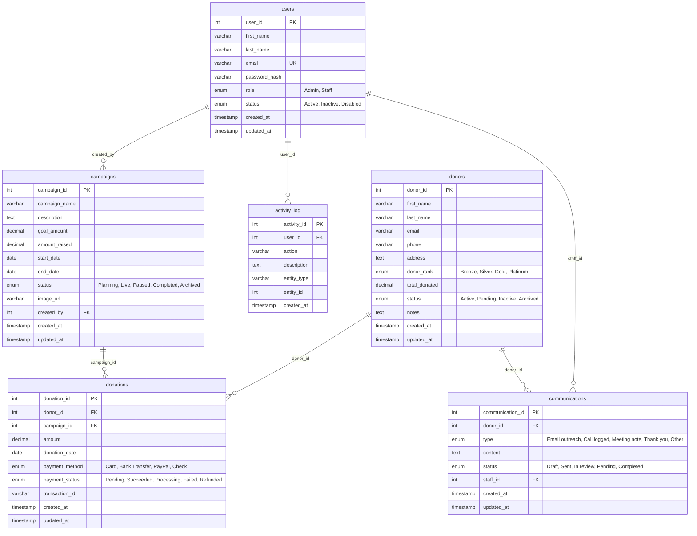
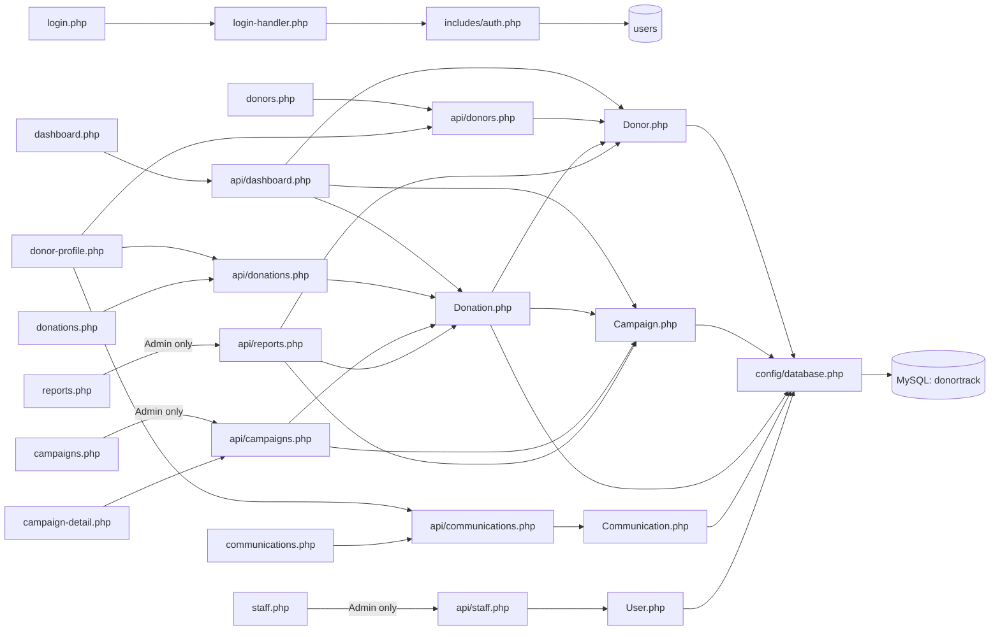

# DonorTrack — Complete Technical Documentation

> Generated by direct source inspection of every file in the repository (45 PHP/JS/CSS/SQL files). Nothing below is inferred from naming conventions alone — every claim traces to a specific file and line.

## 0. Read this first — corrections to common assumptions

The prompt that generated this document assumed a classic MVC stack (Controllers, Middleware, Bootstrap). The real stack differs in three important ways:

| Assumption | Reality in this codebase |
|---|---|
| Bootstrap CSS framework | **Tailwind CSS** loaded via CDN (`<script src="https://cdn.tailwindcss.com">` in [includes/header.php](../includes/header.php)) + **Font Awesome 6** icons + a small custom stylesheet ([assets/css/style.css](../assets/css/style.css)) for glass-morphism cards, badges, modals, sidebar. No Bootstrap file exists anywhere. |
| `controllers/` folder | Defined as a constant in [config/paths.php](../config/paths.php) (`CONTROLLERS_PATH`) but **the folder doesn't exist and nothing requires it**. The `api/*.php` files play the controller role directly — they parse the request, call a Model, and emit JSON. |
| `middleware/` folder | Doesn't exist. Auth/role gating is a set of plain functions in [includes/auth.php](../includes/auth.php) and [includes/functions.php](../includes/functions.php) (`checkSession`, `requireAuth`, `requireRole`, `requireAnyRole`, `requireApiRole`), called at the top of each page router / API file. |
| Server-rendered tables/charts | The PHP views only emit **empty containers** (`<tbody id="...">`, `<canvas id="...">`, `<div id="...">`). All table rows, cards, and chart data are built by JavaScript after a `fetch()` call to an API endpoint. PHP does no data rendering — it only handles auth gating and layout shell. |

Keep this in mind throughout: **every page is a thin PHP shell + a JS module that owns all rendering and all backend calls.**

---

## 1. System Architecture



**Where each file belongs:**

- **Presentation**: everything under `views/`, `assets/js/pages/`, `assets/js/{api,store,utils,layout,charts}.js`, `assets/css/style.css`
- **Routing**: `index.php`, `login.php`, `dashboard.php`, `donors.php`, `donor-profile.php`, `donations.php`, `campaigns.php`, `campaign-detail.php`, `communications.php`, `reports.php`, `staff.php`, `logout.php`
- **Business logic**: `api/*.php` (8 files) + `includes/auth.php` + `includes/functions.php`
- **Data access**: `models/*.php` (5 classes)
- **Data**: `database/database.sql` → MySQL database `donortrack`

There is no separate "AuthController" or "DashboardController" class — the pattern in this codebase is **Router (page or API file) → Model → PDO**, with `includes/` supplying cross-cutting helper functions instead of controller classes.

---

## 2. Folder Structure

```
Non-profit-donor-database-management/
├── index.php                    Entry point — redirects to login.php or dashboard.php
├── login.php                    Page router for the login screen
├── login-handler.php            POST-only JSON endpoint that authenticates and starts a session
├── logout.php                   Destroys session, redirects to login.php
├── dashboard.php                Page router for the dashboard
├── donors.php                   Page router for the donor directory
├── donor-profile.php            Page router for a single donor's profile (?id=)
├── donations.php                Page router for the donation ledger
├── campaigns.php                Page router for the campaign list (Admin-only)
├── campaign-detail.php          Page router for a single campaign (?id=)
├── communications.php           Page router for the donor communications timeline
├── reports.php                  Page router for analytics (Admin-only)
├── staff.php                    Page router for staff/user management (Admin-only)
│
├── config/
│   ├── database.php              Opens the single shared PDO connection ($pdo), exposes getDB()
│   ├── constants.php              All `define()`d app-wide constants (roles, statuses, pagination, etc.)
│   └── paths.php                  Defines filesystem path constants (CONFIG_PATH, VIEWS_PATH, ...) and URL constants (BASE_URL, ASSET_URL, API_URL)
│
├── includes/
│   ├── auth.php                  Session lifecycle: checkSession, loginUser, logoutUser, authenticateUser, createUser, updateUserPassword, requireRole, requireAnyRole
│   ├── functions.php              Formatting/validation/security helpers shared by every page & API: formatCurrency, sanitize, hashPassword, isAdmin, requireApiRole, logActivity, etc.
│   ├── header.php                 <head> — Tailwind CDN, Google Fonts, Font Awesome CDN, style.css; opens <body>
│   ├── footer.php                 Closes </body></html>
│   ├── navbar.php                 Empty <header> shell — actual topbar HTML is injected by assets/js/layout.js
│   └── sidebar.php                Static shell (logo, mobile menu button) — nav links injected by assets/js/layout.js
│
├── models/                        One class per database table. Every method uses PDO prepared statements.
│   ├── User.php                   users table — auth/staff CRUD
│   ├── Donor.php                  donors table
│   ├── Campaign.php                campaigns table
│   ├── Donation.php                donations table (also updates Campaign/Donor rollups)
│   └── Communication.php           communications table
│
├── api/                           JSON endpoints. Each file: checkSession() → switch on $_SERVER['REQUEST_METHOD'] + $_GET['action'] → Model → json_encode
│   ├── check-session.php          GET — returns {authenticated, user} for the frontend's initStore()/initLayout()
│   ├── dashboard.php               GET — aggregated KPI + widget data for the dashboard
│   ├── donors.php                  GET/POST/PUT/DELETE — donor CRUD, search, top donors
│   ├── donations.php                GET/POST/PUT — donation CRUD, trend/breakdown analytics
│   ├── campaigns.php                GET/POST/PUT/DELETE — campaign CRUD (mutations Admin-only)
│   ├── communications.php           GET/POST/PUT/DELETE — donor communication CRUD
│   ├── staff.php                    GET/POST/PUT/DELETE — user/staff CRUD (entirely Admin-only)
│   └── reports.php                  GET — aggregated analytics for the Reports page (Admin-only)
│
├── views/                         PHP templates included by the matching root router. Each re-checks the session independently.
│   ├── auth/login.php              Split-screen sign-in form
│   ├── dashboard/index.php          KPI cards + 2 charts + recent donations table + top donors + campaign alerts
│   ├── donors/index.php             Search/filter panel + donor table + Add/Edit modal
│   ├── donors/profile.php           Donor header + stats + donation/communication history (all empty containers)
│   ├── donations/index.php          Stat cards + transaction table + 2 charts + Log Donation modal
│   ├── campaigns/index.php          Campaign card grid + trend chart + status insights + New Campaign modal
│   ├── campaigns/detail.php         Campaign overview + donation timeline + recent donors (empty containers)
│   ├── communications/index.php     Timeline list + pagination + New Note modal
│   ├── reports/index.php            Revenue/donor/payment charts + weekday heatmap + CSV/Print actions
│   └── staff/index.php              Staff card grid + Add/Edit staff modal
│
├── assets/
│   ├── css/style.css               Custom design-system layer on top of Tailwind: CSS variables, `.card-glass`, `.badge`, `.btn-primary`, `.modal`, `.sidebar-panel`, avatar colors, etc.
│   ├── images/                     Logo/favicon assets referenced by header.php/sidebar.php
│   └── js/
│       ├── api.js                   Shared fetch wrapper: apiGet/apiPost/apiDelete + 401→login.php redirect + renderError()
│       ├── store.js                 Legacy-style data-access layer: one function per API action (getDonors, addDonor, ...), used by most page scripts instead of api.js directly
│       ├── utils.js                 Formatting/UI helpers: formatCurrency, formatDate, formatRelativeTime, initials, avatarClass, levelBadgeClass, statusBadgeClass, exportCsv, openModal/closeModal/bindModalClose
│       ├── layout.js                 Renders the sidebar nav (role-filtered) and topbar (search/notifications/profile menu) into the shells from includes/sidebar.php & navbar.php; exposes initLayout()
│       ├── charts.js                 Chart.js instance factory (initCharts()) + dashboard line-chart updater
│       └── pages/                   One script per page, each is the real "controller" for that page (see per-page sections below)
│
└── database/
    └── database.sql                Full schema (6 tables) + seed data (2 users, 10 donors, 5 campaigns, 10 donations, 3 communications)
```

---

## 3. Database Schema



**Foreign key behavior worth knowing:**
- `donations.donor_id` / `donations.campaign_id` → `ON DELETE RESTRICT` — a donor or campaign with donations can never be hard-deleted at the DB level (which is why both `Donor::archive()` and `Campaign::archive()` are *soft* deletes: they just flip `status` to `Archived`).
- `communications.donor_id` → `ON DELETE CASCADE` — deleting a donor row would cascade-delete their communications (in practice donors are archived, never hard-deleted, so this rarely fires).
- `campaigns.created_by` / `communications.staff_id` / `activity_log.user_id` → `ON DELETE SET NULL` — removing a staff user doesn't break their historical campaigns/notes/log entries.
- `activity_log` is written to by `logActivity()` from almost every mutating API call, but **no page or API endpoint ever reads it back**. It exists purely as an audit trail today; there is no "Activity Log" view in the UI.

---

## 4. Shared Infrastructure

### 4.1 config/

| File | Purpose |
|---|---|
| [database.php](../config/database.php) | Creates one global `$pdo` (PDO, MySQL, `ERRMODE_EXCEPTION`, `FETCH_ASSOC`, real prepared statements via `EMULATE_PREPARES => false`). `getDB()` returns it. Connection failure → HTTP 500 + JSON error, `die()`. |
| [constants.php](../config/constants.php) | All app-wide `define()`s: `CURRENCY_SYMBOL` (₱), `ROLE_ADMIN`/`ROLE_STAFF`, donor/campaign/donation status enums as PHP constants+arrays, `PAYMENT_METHODS`, `SESSION_TIMEOUT` (1800s), `ITEMS_PER_PAGE` (20), date formats. |
| [paths.php](../config/paths.php) | Computes `APP_ROOT` from `dirname(__DIR__)`, then defines filesystem constants (`CONFIG_PATH`, `INCLUDES_PATH`, `MODELS_PATH`, `VIEWS_PATH`, ...) and URL constants (`BASE_URL`, `ASSET_URL`, `API_URL`). Every router/view includes this first. |

### 4.2 includes/

**auth.php** — session & credential functions:

| Function | Params | Returns | Purpose |
|---|---|---|---|
| `checkSession()` | — | bool | True if `$_SESSION['user_id']` is set and not timed out (30 min via `SESSION_TIMEOUT`); refreshes `last_activity` on every call. Session-destroying on timeout. |
| `requireRole($role)` | string | — (redirects) | For **page routers**: calls `requireAuth()`, then redirects to `dashboard.php` if the session role isn't an exact match. Used to Admin-gate `campaigns.php`, `reports.php`, `staff.php`. |
| `requireAnyRole($roles)` | array | — (redirects) | Same as above but accepts a whitelist of roles. Defined but not currently called anywhere (all role-gated pages need exactly Admin). |
| `loginUser($user)` | assoc array from DB | — | Populates `$_SESSION['user_id']`, `$_SESSION['user']` (id/name/email/role/status), `last_activity`, and generates a fresh `csrf_token`. |
| `logoutUser()` | — | — | Empties `$_SESSION`, expires the session cookie, calls `session_destroy()` — hardened against session/cookie reuse after logout. |
| `authenticateUser($email, $password)` | strings | user row or `false` | `SELECT ... WHERE email=? AND status='Active'`, then `verifyPassword()`. Logs (but swallows) PDO exceptions. |
| `createUser($firstName,$lastName,$email,$password,$role)` | — | new `user_id` | Validates required fields/email format/password length ≥8, checks email uniqueness, hashes password, inserts. Not currently called by any page — staff creation goes through `api/staff.php` → `User::create()` instead, which takes an already-hashed password. |
| `updateUserPassword($userId,$newPassword)` | — | bool | Validates length ≥8, hashes, updates. Not currently wired to any UI (no "change password" screen exists). |

**functions.php** — cross-cutting helpers used by almost every page/API file:

| Function | Purpose | CRUD/table |
|---|---|---|
| `formatCurrency($amount)` | `₱` + 2-decimal formatted string | — |
| `formatDate($date, $format='M d, Y')` | Safe date formatting, `—` on empty/invalid | — |
| `sanitize($str)` | `htmlspecialchars` (recursively for arrays) — available for server-rendered output, though in practice almost all rendering happens client-side in JS (which uses its own `escapeHtml()` per page script) | — |
| `validateEmail($email)` / `validatePhone($phone)` | Input validation | — |
| `hashPassword($password)` / `verifyPassword($password,$hash)` | `password_hash(..., PASSWORD_BCRYPT, cost=12)` / `password_verify` | — |
| `generateRandomString($length=32)` | `bin2hex(random_bytes())` | — |
| `getDonorRank($totalDonated)` | Bronze <5,000 / Silver <20,000 / Gold <50,000 / Platinum ≥50,000 | Read `donors` (indirectly, via caller) |
| `calculateCampaignProgress($raised,$goal)` | `min(100, round(raised/goal*100, 2))`, 0 if goal ≤0 | — |
| `jsonResponse($data,$code)` / `errorResponse($msg,$code)` / `successResponse($msg,$data)` | Standard JSON envelope helpers, all call `exit` | — |
| `redirect($path)` | `header('Location: ...'); exit;` | — |
| `isAuthenticated()` / `getCurrentUser()` / `getCurrentUserId()` | Session accessors | — |
| `isAdmin()` / `isStaff()` | Role checks (`isStaff()` is true for Staff **or** Admin) | — |
| `requireAuth()` | Redirects to `login.php` if not authenticated (page routers) | — |
| `requireApiRole($role)` | Returns JSON 403 (does **not** redirect) if role doesn't match — the API equivalent of `requireRole()`, used inside `api/*.php` so a raw `fetch()`/curl call is also blocked, not just page navigation | — |
| `getInitials($name)` / `getAvatarClass($name)` | Server-side equivalents of the JS `initials()`/`avatarClass()` — defined but not actually invoked (rendering is JS-driven) | — |
| `getStatusBadgeClass($status)` | Same story — a server-side mirror of `utils.js`'s `statusBadgeClass()`, unused today | — |
| `generateCSRFToken()` / `validateCSRFToken($token)` | CSRF token generation/verification helpers | **Defined but never called from any `api/*.php` mutation handler** — see Security section, this is a real gap |
| `logActivity($userId,$action,$description,$entityType,$entityId)` | `INSERT INTO activity_log` | **Create**, `activity_log` table |

**header.php / footer.php / navbar.php / sidebar.php** — see Folder Structure table above; these are layout shells, not data-bearing components.

### 4.3 models/ — full function reference

Every model takes `$pdo` in its constructor and every query uses parameter binding (`?` placeholders) — no string-concatenated SQL anywhere in the codebase.

**User.php** (table: `users`)
| Method | Params | Returns | CRUD |
|---|---|---|---|
| `getById($userId)` | int | assoc row (no password_hash) | R |
| `getByEmail($email)` | string | full row (incl. password_hash) | R |
| `getAll($page, $limit)` | ints | paginated rows, newest first | R |
| `getTotalCount()` | — | int | R |
| `create($firstName,$lastName,$email,$passwordHash,$role)` | — | new `user_id` | C |
| `update($userId,$firstName,$lastName,$email,$role,$status)` | — | bool | U |
| `updatePassword($userId,$passwordHash)` | — | bool | U |
| `delete($userId)` | int | bool | D (hard delete) |
| `getStaff()` | — | Active Admin+Staff rows, alphabetical | R |

**Donor.php** (table: `donors`)
| Method | Purpose | CRUD |
|---|---|---|
| `getById`, `getAll($page,$limit,$status=null)`, `getTotalCount`, `getActiveCount`, `getTotalDonated`, `getTopDonors($limit)`, `getRankBreakdown` | Reads, several used for dashboard/reports aggregates | R |
| `create($firstName,$lastName,$email,$phone,$address,$notes)` | Inserts with `status=Active` | C |
| `update($donorId,...,$status,$notes)` | Full field update | U |
| `updateTotalAndRank($donorId)` | Recomputes `total_donated` from **Succeeded+Processing** donations, recalculates `donor_rank` via `getDonorRank()`, writes both back | U — called automatically by `Donation::create/update/updatePaymentStatus` |
| `archive($donorId)` | Sets `status='Archived'` (soft delete — donors are never hard-deleted because `donations.donor_id` is `ON DELETE RESTRICT`) | U |
| `search($query,$limit=20)` | `LIKE` match on first/last/email, excludes Archived | R |

**Campaign.php** (table: `campaigns`)
| Method | Purpose | CRUD |
|---|---|---|
| `getById`, `getAll($page,$limit,$status)`, `getTotalCount`, `getByStatus`, `getTopByRaised`, `getAggregateStats` | Reads | R |
| `getLiveCount()` / `getLive($limit)` | **"Live" here means `status='Live'` AND today is between `start_date` and `end_date`** — a stale Live campaign past its end date is excluded from these counts even though its DB status still says Live | R |
| `create($name,$desc,$goal,$start,$end,$createdBy)` | Inserts with `status='Planning'`, `amount_raised=0` | C |
| `update(...)` / `updateStatus($id,$status)` | Field/status updates | U |
| `updateAmountRaised($campaignId)` | Recomputes `amount_raised` = sum of Succeeded+Processing donations for that campaign | U — called by `Donation::create/update/updatePaymentStatus` |
| `getProgress($campaignId)` | Wraps `calculateCampaignProgress()` | R |
| `archive($campaignId)` | Sets `status='Archived'` (soft delete, same FK-restrict reasoning as donors) | U |
| `getCampaignsNeedingAttention($limit=5)` | `status='Live'` AND `amount_raised/goal_amount < 0.7` | R |

**Donation.php** (table: `donations`)
| Method | Purpose | CRUD |
|---|---|---|
| `getById`, `getAll($page,$limit)`, `getRecent($limit)` (joins donors+campaigns for names), `getTotalCount`, `getTotalAmount($status=null)`, `getByDonor`, `getByCampaign` | Reads | R |
| `create($donorId,$campaignId,$amount,$date,$method)` | **Validates the campaign is `Live` or `Paused`** before inserting, defaults `payment_status='Succeeded'`, then **cascades**: calls `Campaign::updateAmountRaised()` and `Donor::updateTotalAndRank()` | C |
| `update($donationId,$amount,$method,$status)` / `updatePaymentStatus($donationId,$status)` | Updates the row, then **re-runs the same two cascades** so campaign/donor totals never drift | U |
| `getTrendByMonth($months=6)` | Groups Succeeded+Processing donations by `YYYY-MM` for the last N months | R |
| `getPaymentMethodBreakdown()` | Count grouped by `payment_method` | R |
| `getWeekdayRevenue()` | Sum+count grouped by `DAYOFWEEK(donation_date)` (MySQL: 1=Sunday..7=Saturday) | R |
| `getBreakdownByCampaign()` | Per-campaign donation count/total (LEFT JOIN so zero-donation campaigns still appear) | R |

**Communication.php** (table: `communications`)
| Method | Purpose | CRUD |
|---|---|---|
| `getById`, `getAll($page,$limit)` (joins donor + optional staff name), `getRecent($limit)`, `getByDonor($donorId,$limit=null)` | Reads | R |
| `create($donorId,$type,$content,$staffId=null)` | Inserts with `status='Draft'` | C |
| `update($id,$type,$content,$status,$staffId)` / `updateStatus($id,$status)` | Field/status updates | U |
| `delete($id)` | Hard delete | D |

### 4.4 Shared frontend infrastructure (assets/js/)

| File | Exports | Role |
|---|---|---|
| **api.js** | `apiGet`, `apiPost`, `apiDelete`, `renderError` | Thin `fetch()` wrapper with `credentials:'same-origin'` (sends the PHP session cookie), auto-redirects to `login.php` on HTTP 401, throws on non-2xx with the server's `error` message. The comment in the file itself says new page scripts should prefer this over `store.js` — but in practice most existing page scripts still use `store.js`. |
| **store.js** | `initStore`, one getter/mutator pair per resource (`getDonors`/`addDonor`/..., `getCampaigns`/..., `getDonations`/..., `getCommunications`/..., `getStaff`/...) | Older, more verbose data-access layer — each function does its own raw `fetch()` + `try/catch` + `console.error`, and caches the last result in an in-memory `cache` object. `initStore()` also pings `api/check-session.php`, redirects to `login.php` if unauthenticated, and starts a 5-minute `setInterval` session-liveness check. |
| **utils.js** | `formatCurrency`, `formatDate`, `formatRelativeTime`, `initials`, `avatarClass`, `levelBadgeClass`, `statusBadgeClass`, `exportCsv`, `openModal`/`closeModal`/`bindModalClose` | Pure UI helpers used by nearly every page script — badge coloring, CSV export (builds an in-browser CSV Blob and triggers a download, no server involvement), and the shared modal open/close/backdrop-click wiring. |
| **layout.js** | `renderSidebar`, `renderTopBar`, `initLayout` | Populates the sidebar nav links (filtered by role — Campaigns/Staff/Reports only shown to Admin) and the topbar (search box, notification bell stub, profile pill + dropdown with Logout). Calls `api/check-session.php` itself to get the current user, independent of `store.js`. **Every page script calls `initLayout()`.** |
| **charts.js** | `initCharts`, `updateDashboardCharts` | Declares empty Chart.js instances for every `<canvas>` id used across the app (`lineChart`, `pieChart`, `campaignLineChart`, `donationsLineChart`, `paymentMethodsChart`, `reportsLineChart`, `donorPieChart`) with shared styling defaults. Charts start empty; each page script fetches real data afterward and calls `Chart.getChart(id).update()`. |

**Important nuance about role-based UI**: `layout.js`'s sidebar filtering and every page script's `isAdmin` check (e.g. hiding the Delete button on `donors.js`) are **UX conveniences only**. The real enforcement always happens server-side — either `requireRole()` on the page router or `requireApiRole()` inside the API file. This is called out explicitly in code comments in `layout.js` and `functions.php`.

---

## 5. Security

- **Authentication**: email + bcrypt password (`PASSWORD_BCRYPT`, cost 12) via PHP's `password_hash`/`password_verify`. No password complexity beyond a minimum length of 8 (enforced only in `createUser()`/`updateUserPassword()` in `includes/auth.php`, which aren't currently wired to any UI — staff creation via `api/staff.php` generates a random temp password instead and never enforces a minimum length on it since it's `bin2hex(random_bytes(8))`, i.e. 16 hex chars).
- **Sessions**: native PHP sessions (`session_start()` in `includes/auth.php`). `$_SESSION['user']` holds id/name/email/role/status; `last_activity` is refreshed on every `checkSession()` call; sessions auto-expire after 30 minutes idle (`SESSION_TIMEOUT`). `logoutUser()` clears `$_SESSION`, expires the cookie, and calls `session_destroy()`.
- **Authorization / RBAC**: Two roles, `Admin` and `Staff`. Enforced in two parallel places that must both exist:
  - Page routers: `requireRole(ROLE_ADMIN)` in `campaigns.php`, `reports.php`, `staff.php` — an unauthorized navigation redirects to `dashboard.php`.
  - API endpoints: `requireApiRole(ROLE_ADMIN)` guarding campaign create/update/status/archive, all of `api/staff.php`, and all of `api/reports.php` — an unauthorized raw request gets HTTP 403 JSON, not a redirect (because API responses must stay JSON for `fetch()` error handling).
  - Donor archive (`DELETE api/donors.php?action=archive`) is also Admin-only. Donor/donation/communication **create and update**, however, are open to any authenticated user (Admin or Staff) — there's no Admin gate on those.
- **SQL injection protection**: 100% PDO prepared statements with `PDO::ATTR_EMULATE_PREPARES => false` (real server-side prepares, not just PHP-side escaping) across all 5 models. No raw string concatenation of user input into SQL anywhere in the codebase.
- **XSS protection**: Since rendering is client-side, every page script defines its own local `escapeHtml()` (creates a `<div>`, sets `.textContent`, reads back `.innerHTML`) and applies it to any user-supplied string before interpolating into template literals. Server-side, `sanitize()` exists in `functions.php` but isn't invoked (there's no server-rendered dynamic content to sanitize).
- **CSRF**: `generateCSRFToken()`/`validateCSRFToken()` exist in `includes/functions.php` and a token is generated at login (`loginUser()`), but **no API endpoint currently calls `validateCSRFToken()`** — state-changing requests (`POST`/`PUT`/`DELETE` in `api/*.php`) are protected only by the browser's same-origin `fetch()` + session cookie, not by a token check. This is a real gap if the app is ever exposed to cross-site form-based attacks (JSON-only endpoints are harder to CSRF via a plain `<form>`, but not immune).
- **Session-cookie scope**: `credentials: 'same-origin'` on every `fetch()` (in `api.js`), so the session cookie is never sent cross-origin.
- **Input validation**: centralized in `includes/functions.php` (`validateEmail`, `validatePhone`) and re-checked per-field inside each `api/*.php` handler (e.g., amount > 0, valid enum values for status/payment method, end date ≥ start date for campaigns).

---

## 6. Per-Page Documentation

Each section below follows: Overview → Frontend Flow → Backend Flow → File Execution Flow → Database Interaction → User Flow → Call Hierarchy → Dependencies.

### 6.1 Login (`login.php`)

**1. Overview**
- Purpose: authenticate a user and start a session.
- Access: **Guest only** — `login.php` itself redirects an already-authenticated user straight to `dashboard.php` (`checkSession()` check in the router).
- Navigation: the only page reachable without a session; every other router redirects here on `!checkSession()`, and `api.js`/`store.js` redirect here on any HTTP 401.
- Problem solved: gatekeeping — nothing else in the app is reachable without a valid session.

**2. Frontend Flow**
- `views/auth/login.php`: split-screen layout — left panel is a static Tailwind gradient hero (`hidden lg:flex`), right panel has the actual form.
- Form `#loginForm`: `email` (type=email, required), `password` (type=password, required) with a show/hide toggle button `#togglePassword`, submit button "Sign in".
- `#errorMessage` div (hidden by default) shows inline validation/auth errors.
- No modal, no table, no chart, no sidebar/navbar on this page (it's pre-auth).
- JS: `assets/js/pages/login.js` (plain script, not a module import) — button click toggles `input.type` between `password`/`text`; form submit handler prevents default, POSTs JSON to `login-handler.php`, and on success does `window.location.href = data.redirect` (which is always `index.php`); on failure shows `alert(data.error)`.

**3. Backend Flow**
```
User clicks "Sign in"
  ↓
login.js: fetch('login-handler.php', POST, {email, password})
  ↓
login-handler.php receives POST (Content-Type: application/json)
  ↓
Rejects non-POST methods (405) and empty email/password (400)
  ↓
authenticateUser($email, $password)  [includes/auth.php]
  ↓
Prepares: SELECT user_id, first_name, last_name, email, password_hash, role, status
          FROM users WHERE email = ? AND status = 'Active'
  ↓
verifyPassword($password, $user['password_hash'])  [bcrypt password_verify]
  ↓
If no match → 401 {"error": "Invalid email or password"}
If user status isn't Active → 403 {"error": "User account is not active"}
  ↓
loginUser($user) → sets $_SESSION['user_id'], $_SESSION['user'], last_activity, csrf_token
  ↓
Responds 200 {"success": true, "redirect": "index.php"}
  ↓
login.js redirects browser to index.php
  ↓
index.php: checkSession() passes → redirect to dashboard.php
```

**4. File Execution Flow**
```
login.php (router)
    ↓ require config/paths.php, constants.php, database.php, includes/auth.php
    ↓ checkSession() == false → continue
    ↓ require views/auth/login.php
        ↓ include includes/header.php (Tailwind/FA CDN, <body>)
        ↓ include includes/footer.php (</body></html>)
        ↓ <script type="module" src="assets/js/pages/login.js">
              ↓ (on submit) fetch('login-handler.php')
                  ↓ login-handler.php
                      require config/constants.php, config/database.php,
                              includes/functions.php, includes/auth.php, models/User.php
                      ↓ authenticateUser()  [uses raw PDO in includes/auth.php, NOT the User model]
                      ↓ loginUser()
                      ↓ echo json_encode(...)
              ↓ window.location.href = 'index.php'
```
Note: `login-handler.php` `require_once 'models/User.php'` but never actually instantiates `User` — authentication is done with a raw PDO query directly inside `authenticateUser()`. This is a minor dead import, not a bug.

**5. Folder References**: `views/auth/login.php`, `login.php`, `login-handler.php`, `includes/auth.php`, `includes/functions.php`, `assets/js/pages/login.js`.

**6. Functions Used**: `checkSession()`, `authenticateUser()`, `loginUser()` (all in `includes/auth.php`).

**7. Database Interaction**
- Table: `users`.
- SELECT: `user_id, first_name, last_name, email, password_hash, role, status` WHERE `email=? AND status='Active'`.
- No INSERT/UPDATE/DELETE on this page.

**8. Complete User Flow**
```
Guest opens login.php
  ↓ sees split-screen sign-in form
Enters work email + password
  ↓ (optionally clicks eye icon to reveal password)
Clicks "Sign in"
  ↓ JS POSTs credentials as JSON
Backend validates email/password non-empty
  ↓ queries users table for Active user with matching email
  ↓ verifies bcrypt hash
  ↓ (if account not Active) shows "User account is not active"
  ↓ (if credentials wrong) shows "Invalid email or password"
  ↓ (on success) session started, csrf token generated
Browser redirected to index.php → dashboard.php
  ↓ dashboard.js runs initLayout() → fetches api/check-session.php → renders name/role in topbar
```

**9. Call Hierarchy**
```
login.php
  ↓ views/auth/login.php
      ↓ login.js
          ↓ login-handler.php
              ↓ authenticateUser() [includes/auth.php]
                  ↓ getDB() [config/database.php]
                  ↓ verifyPassword() [includes/functions.php]
              ↓ loginUser() [includes/auth.php]
          ↓ JSON {success, redirect}
      ↓ location redirect
```

**10. Dependencies**
```
login.php → (no Controller/Model layer for GET) → views/auth/login.php
login.js → login-handler.php → includes/auth.php (business logic, no dedicated Model class) → config/database.php → MySQL users table
```

---

### 6.2 Dashboard (`dashboard.php` / `index.php`)

**1. Overview**
- Purpose: at-a-glance KPIs — total donors, total donation revenue, campaign counts, a donation trend chart, a contribution-mix chart, latest donations table, top donors, and campaigns that need attention.
- Access: any authenticated user (Admin or Staff) — no role gate in `dashboard.php`.
- Navigation: default landing page (`index.php` redirects here); first sidebar link; every router that isn't role-restricted lands you back here on unauthorized access.
- Problem solved: single-screen situational awareness without digging into each sub-page.

**2. Frontend Flow**
- `views/dashboard/index.php`: sidebar + navbar shells, then 4 KPI `<article class="metric-card">` cards (`#stat-donors`, `#stat-donations`, `#stat-campaigns`, `#stat-active-campaigns`/`#stat-active-campaigns-display`), a 2-column chart section (`#lineChart` donation trend, `#pieChart` contribution mix — both Chart.js `<canvas>`), a recent-donations table (`#recent-donations-body`) with a "View all" link to `donations.php`, a top-donors list (`#top-donors-list`), and a campaign-alerts grid (`#campaign-progress-list`) with a "Manage campaigns" link to `campaigns.php`.
- No forms, no modals on this page — it's read-only.
- Scripts loaded: `https://cdn.jsdelivr.net/npm/chart.js` then `assets/js/pages/dashboard.js` (module).

**3. Backend Flow**
```
dashboard.js: init()
  ↓ initLayout({showSearch:true})       → fetch api/check-session.php → render sidebar/topbar
  ↓ initCharts()                        → instantiate empty lineChart/pieChart
  ↓ apiGet('api/dashboard.php')
      ↓ api/dashboard.php: checkSession() → 401 if not authed
      ↓ new Donor($pdo), Campaign($pdo), Donation($pdo)
      ↓ Donor::getActiveCount()          → COUNT(*) WHERE status='Active'
      ↓ Donation::getTotalAmount('Succeeded') → SUM(amount) WHERE payment_status='Succeeded'
      ↓ Campaign::getTotalCount()         → COUNT(*)
      ↓ Campaign::getLiveCount()          → COUNT(*) WHERE status='Live' AND CURDATE() BETWEEN start/end
      ↓ Donor::getTopDonors(3)            → top 3 Active donors by total_donated
      ↓ Donation::getRecent(5)            → JOIN donors+campaigns, latest 5
      ↓ Campaign::getCampaignsNeedingAttention(2) → Live campaigns <70% funded
      ↓ echo json_encode({...})
  ↓ renderStats(), renderRecentDonations(), renderTopDonors(), renderCampaignProgress()
  ↓ updateDashboardCharts(mapDonationsForChart(recentDonations))  → fills lineChart
  ↓ apiGet('api/donations.php', {action:'breakdown'})
      ↓ Donation::getBreakdownByCampaign() → per-campaign totals
  ↓ renderDonationPieChart(breakdown)       → fills pieChart
```

**4. File Execution Flow**
```
index.php / dashboard.php (router)
    ↓ checkSession() → views/dashboard/index.php
        ↓ header.php / sidebar.php / navbar.php shells / footer.php
        ↓ dashboard.js
            ↓ initLayout() → api/check-session.php → getCurrentUser() [functions.php]
            ↓ apiGet('api/dashboard.php')
                ↓ api/dashboard.php
                    require config/*, includes/*, models/Donor.php, Campaign.php, Donation.php
                    ↓ Donor::getActiveCount / getTopDonors  (models/Donor.php)
                    ↓ Campaign::getTotalCount / getLiveCount / getCampaignsNeedingAttention (models/Campaign.php)
                    ↓ Donation::getTotalAmount / getRecent (models/Donation.php)
                    ↓ each Model method → $pdo->prepare()/execute()/fetch() → MySQL
                    ↓ json_encode($stats) → HTTP response
            ↓ apiGet('api/donations.php?action=breakdown') → Donation::getBreakdownByCampaign()
            ↓ DOM render (innerHTML) + Chart.js .update()
```

**5. Folder References**: `views/dashboard/index.php`, `api/dashboard.php`, `api/donations.php` (breakdown action only), `models/Donor.php`, `Campaign.php`, `Donation.php`, `assets/js/pages/dashboard.js`, `assets/js/charts.js`.

**6. Functions Used** (dashboard.js): `init`, `renderStats`, `renderRecentDonations`, `renderTopDonors`, `renderCampaignProgress`, `renderDonationPieChart`, `mapDonationsForChart`, `emptyRow`, `escapeHtml`. Backend: `Donor::getActiveCount/getTopDonors`, `Campaign::getTotalCount/getLiveCount/getCampaignsNeedingAttention`, `Donation::getTotalAmount/getRecent/getBreakdownByCampaign`.

**7. Database Interaction**
- Tables: `donors`, `campaigns`, `donations` (read-only, all SELECTs — no writes on this page).
- Columns read: `donors.status,total_donated,donor_rank,first_name,last_name`; `campaigns.status,start_date,end_date,goal_amount,amount_raised,campaign_name`; `donations.amount,payment_status,donation_date,donor_id,campaign_id` (+ joined donor/campaign names).
- Relationships exercised: `donations.donor_id → donors.donor_id`, `donations.campaign_id → campaigns.campaign_id` (via `JOIN` in `Donation::getRecent()`).

**8. Complete User Flow**
```
Admin/Staff opens Dashboard
  ↓ sidebar/topbar render with their name, avatar initials, role
  ↓ 4 KPI cards show "—" placeholders, then populate from api/dashboard.php
  ↓ donation trend line chart fills from the 5 most recent donations
  ↓ contribution-mix pie chart fills from per-campaign totals
  ↓ recent donations table lists latest 5 gifts with donor/campaign/amount/date/status badge
  ↓ top 3 donors card lists name, rank, lifetime total
  ↓ campaign alerts show up to 2 Live campaigns under 70% funded, with a progress bar
  ↓ user can click "View all" → donations.php, or "Manage campaigns" → campaigns.php
```

**9. Call Hierarchy**
```
Dashboard
  dashboard.php
    ↓ views/dashboard/index.php
        ↓ dashboard.js
            ↓ api/dashboard.php
                ↓ Donor.php / Campaign.php / Donation.php
                    ↓ config/database.php (PDO)
                        ↓ MySQL
                ↓ returns JSON stats
            ↓ dashboard.js renders cards/table/lists, updates charts.js instances
```

**10. Dependencies**
```
dashboard.php → views/dashboard/index.php → dashboard.js
    → api/dashboard.php → {Donor, Campaign, Donation} models → config/database.php → MySQL
    → api/donations.php?action=breakdown → Donation model
Shared: layout.js (sidebar/topbar), charts.js (chart instances), utils.js (formatCurrency/formatDate/badges)
```

---

### 6.3 Donors — Directory (`donors.php`)

**1. Overview**
- Purpose: the donor CRM directory — search, filter, add, edit, archive, export donors.
- Access: any authenticated user; the **Delete/Archive button is hidden client-side unless `role === 'Admin'`**, and the archive API call itself is Admin-gated server-side (`requireApiRole(ROLE_ADMIN)` in `api/donors.php`'s DELETE handler).
- Navigation: sidebar "Donors" link; dashboard doesn't deep-link here directly except via the donor names (which link to `donor-profile.php`).
- Problem solved: central donor record-keeping — a single place to see/update everyone's contact info, giving level, and lifetime total.

**2. Frontend Flow**
- `views/donors/index.php`: header with "Export CSV" and "Add Donor" buttons; a search card (`#donorSearch`); a filter card (`#filterLevel`, `#filterStatus` selects, "Reset"/"Apply filters" buttons); a "Donor performance" summary card (`#summary-silver`, `#summary-gold`, `#summary-lifetime`); the donor table (`#donors-table-body`) with pagination (`#prevPage`/`#nextPage`, `#pageInfo`, `#showingInfo`); and an Add/Edit modal (`#donorModal`) with form `#donorForm` (hidden `#donorId`, `#donorName`, `#donorEmail`, `#donorPhone`, `#donorRole` (mapped to `notes`), `#donorLevel` select, `#donorStatus` select).
- Table row actions per donor: "View" (link to `donor-profile.php?id=`), "Edit" (opens modal pre-filled), "Delete" (Admin-only, confirms then archives).
- All filtering/searching/pagination happens **client-side in JS** against the full donor list already fetched — there's no server-side search query triggered per keystroke (the `search`/`?action=search` API action exists but isn't actually called by `donors.js`; only used elsewhere, if at all — in the current code, `donors.js` filters the in-memory `allDonors` array).

**3. Backend Flow**
```
Page load:
  donors.js: init() → initStore() → initLayout() → getDonors()
    ↓ GET api/donors.php?action=list&page=1
        checkSession() → new Donor($pdo) → Donor::getAll(1, 20, null)
        ↓ SELECT * FROM donors ORDER BY total_donated DESC, updated_at DESC LIMIT 20 OFFSET 0
        ↓ Donor::getTotalCount(null) → SELECT COUNT(*) FROM donors
        ↓ json_encode({donors, total, page, limit})
  ↓ applyFilters() (client-side, no request) → render() paints table + pagination
  ↓ renderSummary() computes Silver/Gold counts + lifetime total from the already-fetched array

Add donor:
  Click "Add Donor" → openModal('donorModal') (empty form)
  Submit #donorForm → saveDonor()
    ↓ POST api/donors.php?action=create {first_name,last_name,email,phone,notes,status}
        validates required fields, email format, phone format
        ↓ Donor::create(...) → INSERT INTO donors (..., status='Active', created_at=NOW())
        ↓ logActivity(userId, 'create', "Created donor: ...", 'donor', donorId)
        ↓ {success, donor_id}
    ↓ closeModal, re-fetch getDonors(), re-render

Edit donor:
  Click "Edit" → openEditModal(id) pre-fills form from in-memory allDonors
  Submit → saveDonor() with donorId set
    ↓ PUT api/donors.php?action=update {donor_id, ...fields}
        Donor::getById() to fill any omitted fields, validates email
        ↓ Donor::update(...) → UPDATE donors SET ... WHERE donor_id=?
        ↓ logActivity(..., 'update', ...)
    ↓ re-fetch + re-render

Delete/Archive donor (Admin only):
  Click "Delete" → confirm() → deleteDonor(id)
    ↓ DELETE api/donors.php?action=archive {donor_id}
        requireApiRole('Admin') → 403 if not Admin
        ↓ Donor::archive(donorId) → UPDATE donors SET status='Archived'
        ↓ logActivity(..., 'archive', ...)
    ↓ re-fetch + re-render (archived donor now excluded from... actually still returned by getAll() since no status filter is applied by default; it will show with an "Archived" status badge)

Export CSV:
  Click "Export CSV" → exportCsv() (utils.js) — pure client-side, builds a Blob from the currently filtered/all donors, no server round-trip
```

**4. File Execution Flow**
```
donors.php (router)
    ↓ checkSession() → views/donors/index.php
        ↓ header/sidebar/navbar/footer shells
        ↓ donors.js
            ↓ initStore() → api/check-session.php
            ↓ initLayout() → api/check-session.php (again, independently)
            ↓ getDonors() [store.js] → fetch api/donors.php?action=list&page=1
                ↓ api/donors.php
                    require config/*, includes/*, models/Donor.php
                    ↓ checkSession()
                    ↓ new Donor($pdo) → Donor::getAll() / getTotalCount()
                        ↓ PDO prepare/execute/fetchAll → MySQL donors table
                    ↓ echo json_encode(['donors'=>..., 'total'=>...])
            ↓ applyFilters() / render() → DOM update
```

**5. Folder References**: `views/donors/index.php`, `api/donors.php`, `models/Donor.php`, `assets/js/pages/donors.js`, `assets/js/store.js`, `assets/js/utils.js`.

**6. Functions Used**
- JS: `init`, `getFilters`, `applyFilters`, `resetFilters`, `renderSummary`, `render`, `openAddModal`, `openEditModal`, `saveDonor`, `exportDonors`, `escapeHtml` (all in `donors.js`); `getDonors`/`addDonor`/`updateDonor`/`deleteDonor` (`store.js`).
- PHP: `Donor::getAll`, `getTotalCount`, `create`, `update`, `archive`; `requireApiRole`; `logActivity`; `validateEmail`/`validatePhone`.

**7. Database Interaction**
- Table: `donors` (primary); reads `donations`/campaigns indirectly not on this page.
- SELECT: `Donor::getAll()` (all columns, paged), `Donor::getTotalCount()`.
- INSERT: `Donor::create()` → `first_name,last_name,email,phone,address,notes,status,created_at`.
- UPDATE: `Donor::update()` → `first_name,last_name,email,phone,address,status,notes,updated_at`; `Donor::archive()` → `status='Archived',updated_at`.
- No DELETE (archiving is a soft delete via UPDATE, not a SQL DELETE) — enforced at the DB level too since `donations.donor_id` is `ON DELETE RESTRICT`.

**8. Complete User Flow**
```
User opens Donors
  ↓ table populates from GET api/donors.php?action=list
  ↓ types in search box → table re-filters instantly (client-side, no request)
  ↓ picks Level/Status filters → clicks Apply filters → table re-filters
  ↓ clicks Add Donor → fills modal form → Save
      ↓ POST create → donor inserted → table refreshed from server
  ↓ clicks Edit on a row → modal pre-fills → changes a field → Save
      ↓ PUT update → table refreshed
  ↓ (Admin) clicks Delete → confirms → DELETE archive → donor's status becomes Archived, still visible with badge
  ↓ clicks Export CSV → browser downloads donors.csv built from the currently visible filtered set
  ↓ clicks "View" on a row → navigates to donor-profile.php?id=<donor_id>
```

**9. Call Hierarchy**
```
Donors
  donors.php
    ↓ views/donors/index.php
        ↓ donors.js
            ↓ store.js (getDonors/addDonor/updateDonor/deleteDonor)
                ↓ api/donors.php
                    ↓ models/Donor.php
                        ↓ config/database.php → MySQL donors
                    ↓ includes/functions.php (logActivity, validateEmail, requireApiRole)
```

**10. Dependencies**
```
donors.php → views/donors/index.php → donors.js
    → store.js → api/donors.php → Donor.php → database.php → MySQL
Shared: layout.js, utils.js (formatCurrency/formatDate/badges/exportCsv/modal helpers)
```

---

### 6.4 Donor Profile (`donor-profile.php?id=`)

**1. Overview**
- Purpose: a single donor's full history — lifetime stats, every donation they've made, every communication logged against them.
- Access: any authenticated user; read-only page (no forms/modals at all).
- Navigation: reached via "View" link on the Donors table, or a direct `?id=` URL.
- Problem solved: donor-level relationship view for stewardship — "what has this person given, and what have we told them?"

**2. Frontend Flow**
- `views/donors/profile.php`: "All donors" back-link, then three empty containers filled entirely by JS: `#profileHeader` (avatar, name, email/phone, rank badge), `#profileStats` (3 stat cards: lifetime donations, number of donations, favorite/highest-value campaign), `#donationHistory` and `#communicationHistory` (two side-by-side lists).
- No table, no chart, no modal, no form.

**3. Backend Flow**
```
donor-profile.js: init()
  ↓ initStore(); initLayout()
  ↓ read ?id= from URL
  ↓ getDonor(id) → GET api/donors.php?action=get&id=<id>
      ↓ Donor::getById($id) → SELECT * FROM donors WHERE donor_id=?
      ↓ if not found → 404; JS redirects to donors.php
  ↓ Promise.all([
        getDonationsByDonor(id)      → GET api/donations.php?action=by-donor&donor_id=<id>
            ↓ Donation::getByDonor() → JOIN campaigns, WHERE donor_id=?, ORDER BY donation_date DESC
        getCommunicationsByDonor(id) → GET api/communications.php?action=by-donor&donor_id=<id>
            ↓ Communication::getByDonor() → LEFT JOIN users (staff), WHERE donor_id=?, ORDER BY created_at DESC
    ])
  ↓ compute "favorite campaign" client-side = campaign of the single highest-amount gift
  ↓ render profileHeader / profileStats / donationHistory / communicationHistory (innerHTML)
```

**4. File Execution Flow**
```
donor-profile.php (router)
    ↓ checkSession() → views/donors/profile.php
        ↓ shells + donor-profile.js
            ↓ getDonor(id)          → api/donors.php (action=get) → Donor::getById → MySQL
            ↓ getDonationsByDonor   → api/donations.php (action=by-donor) → Donation::getByDonor → MySQL (JOIN campaigns)
            ↓ getCommunicationsByDonor → api/communications.php (action=by-donor) → Communication::getByDonor → MySQL (LEFT JOIN users)
            ↓ DOM render
```

**5. Folder References**: `views/donors/profile.php`, `api/donors.php`, `api/donations.php`, `api/communications.php`, `models/Donor.php`, `Donation.php`, `Communication.php`, `assets/js/pages/donor-profile.js`.

**6. Functions Used**: `getDonor`, `getDonationsByDonor`, `getCommunicationsByDonor` (store.js); `Donor::getById`, `Donation::getByDonor`, `Communication::getByDonor` (models).

**7. Database Interaction**
- Tables: `donors` (single row), `donations` JOIN `campaigns` (WHERE `donor_id=?`), `communications` LEFT JOIN `users` (WHERE `donor_id=?`).
- Read-only page — no writes.
- Relationships shown: `donors.donor_id` ← `donations.donor_id` → `campaigns.campaign_id`; `donors.donor_id` ← `communications.donor_id` → `users.user_id` (staff attribution, nullable).

**8. Complete User Flow**
```
User clicks "View" on a donor row
  ↓ donor-profile.php?id=42 loads
  ↓ JS fetches the donor record; if missing, bounces back to donors.php
  ↓ header shows avatar initials, name, email/phone, rank badge
  ↓ stats show lifetime total, count of gifts, favorite campaign (by highest single gift)
  ↓ donation history list shows every gift (campaign, date, method, amount)
  ↓ communication history list shows every note (type, status badge, content, staff + relative time)
  ↓ "All donors" link returns to donors.php
```

**9. Call Hierarchy**
```
Donor Profile
  donor-profile.php
    ↓ views/donors/profile.php
        ↓ donor-profile.js
            ↓ api/donors.php (get) → Donor.php → MySQL
            ↓ api/donations.php (by-donor) → Donation.php → MySQL
            ↓ api/communications.php (by-donor) → Communication.php → MySQL
```

**10. Dependencies**
```
donor-profile.php → views/donors/profile.php → donor-profile.js
    → {api/donors.php, api/donations.php, api/communications.php} → {Donor, Donation, Communication} models → MySQL
```

---

### 6.5 Donations (`donations.php`)

**1. Overview**
- Purpose: the transaction ledger — log new donations, browse/filter all donations, see revenue/average-gift/refund-rate stats, weekly pace + payment-source charts.
- Access: any authenticated user; no delete/archive action exists for donations at all (financial records are append-only/editable, never removed).
- Navigation: sidebar "Donations" link; dashboard's "View all" link on recent donations.
- Problem solved: financial record-keeping and light reconciliation (status tracking Pending→Succeeded/Processing/Refunded).

**2. Frontend Flow**
- `views/donations/index.php`: header with "Export CSV"/"Log donation" buttons; 3 stat cards (`#stat-revenue`, `#stat-avg`, `#stat-refund`); a transaction table (`#donations-table-body`) with a status filter select (`#filterStatus`); two charts (`#donationsLineChart` weekly pace, `#paymentMethodsChart` payment sources); a "Log donation" modal (`#donationModal`) with form `#donationForm` (`#donationDonor`/`#donationCampaign` selects populated from live data, `#donationAmount`, `#donationDate`, `#donationMethod`, `#donationStatus`).
- Each table row has a "Receipt" button that shows a plain `alert()` with the donation's details (not a real printable receipt/modal).

**3. Backend Flow**
```
Page load:
  donations.js: init() → initStore(); initLayout(); initCharts()
  ↓ Promise.all([getDonors(), getCampaigns(), getDonations()])
      ↓ GET api/donors.php?action=list      → Donor::getAll()
      ↓ GET api/campaigns.php?action=list   → Campaign::getAll()
      ↓ GET api/donations.php?action=list   → Donation::getAll() + getTotalCount()
  ↓ populateDonorSelect() / populateCampaignSelect() (fills the Log Donation modal's dropdowns)
  ↓ updateStats() — revenue/avg/refund-rate computed client-side from the fetched donations array
  ↓ renderTable() — client-side status filter, no re-fetch
  ↓ renderCharts() → Promise.all([getWeekdayRevenue(), getPaymentMethodBreakdown()])
      ↓ GET api/donations.php?action=weekday-revenue   → Donation::getWeekdayRevenue()
      ↓ GET api/donations.php?action=payment-breakdown → Donation::getPaymentMethodBreakdown()
      ↓ fills donationsLineChart (Mon→Sun reordered from MySQL's Sun-first DAYOFWEEK) and paymentMethodsChart

Log a donation:
  Click "Log donation" → modal opens, date pre-filled to today
  Submit → saveDonation()
    ↓ POST api/donations.php?action=create {donor_id, campaign_id, amount, donation_date, payment_method}
        validates donor_id/campaign_id present, amount>0, payment_method in whitelist
        validates donor exists (Donor::getById), campaign exists (Campaign::getById)
        ↓ Donation::create(...)
            ↓ checks campaign.status is 'Live' or 'Paused' (else throws)
            ↓ INSERT INTO donations (..., payment_status='Succeeded', created_at=NOW())
            ↓ Campaign::updateAmountRaised($campaignId)  — recomputes campaigns.amount_raised
            ↓ Donor::updateTotalAndRank($donorId)         — recomputes donors.total_donated + donor_rank
        ↓ logActivity(..., 'create', "Created donation: $...", 'donation', donationId)
    ↓ closeModal, re-fetch getDonations(), updateStats(), renderTable(), renderCharts()
```

**4. File Execution Flow**
```
donations.php (router)
    ↓ checkSession() → views/donations/index.php
        ↓ shells + Chart.js CDN + donations.js
            ↓ getDonors/getCampaigns/getDonations [store.js] → api/donors.php, api/campaigns.php, api/donations.php
                ↓ Donor.php / Campaign.php / Donation.php → PDO → MySQL
            ↓ saveDonation() → api/donations.php (action=create)
                ↓ Donation::create()
                    ↓ Campaign::updateAmountRaised()  [models/Campaign.php]
                    ↓ Donor::updateTotalAndRank()      [models/Donor.php]
                ↓ logActivity() [includes/functions.php] → INSERT activity_log
```

**5. Folder References**: `views/donations/index.php`, `api/donations.php`, `api/donors.php`, `api/campaigns.php`, `models/Donation.php`, `Donor.php`, `Campaign.php`, `assets/js/pages/donations.js`, `assets/js/charts.js`.

**6. Functions Used**: JS — `init`, `populateDonorSelect/populateCampaignSelect`, `updateStats`, `renderTable`, `renderCharts`, `saveDonation`, `exportDonations`. PHP — `Donation::getAll/getTotalCount/create/getWeekdayRevenue/getPaymentMethodBreakdown`, `Campaign::updateAmountRaised`, `Donor::updateTotalAndRank`.

**7. Database Interaction**
- Tables: `donations` (primary), `donors`/`campaigns` (read for dropdowns + name display; write-cascade on create).
- SELECT: `Donation::getAll`, `getTotalCount`, `getWeekdayRevenue` (`GROUP BY DAYOFWEEK`), `getPaymentMethodBreakdown` (`GROUP BY payment_method`).
- INSERT: `donations` row on Log Donation.
- UPDATE (cascade side-effects, not user-visible as separate actions): `campaigns.amount_raised`, `donors.total_donated`+`donor_rank`.
- No DELETE anywhere for donations.

**8. Complete User Flow**
```
User opens Donations
  ↓ stat cards + table + charts populate from live data
  ↓ filters table by status via dropdown (client-side)
  ↓ clicks "Log donation" → picks donor + campaign from dropdowns, enters amount/date/method
  ↓ Save → backend verifies campaign is Live/Paused, inserts donation,
      recalculates that campaign's amount_raised and that donor's total_donated/rank
  ↓ table/stats/charts refresh to reflect the new donation
  ↓ clicks "Receipt" on a row → sees an alert() with donation details
  ↓ clicks "Export CSV" → downloads donations.csv of the full dataset
```

**9. Call Hierarchy**
```
Donations
  donations.php
    ↓ views/donations/index.php
        ↓ donations.js
            ↓ store.js → api/donations.php ↔ Donation.php ↔ MySQL
                                  ↕ (on create) Campaign.php, Donor.php cascades
            ↓ store.js → api/donors.php / api/campaigns.php (dropdown data)
```

**10. Dependencies**
```
donations.php → views/donations/index.php → donations.js
    → api/donations.php → Donation.php ⇄ {Campaign.php, Donor.php} → database.php → MySQL
    → api/donors.php, api/campaigns.php (read-only, for selects)
Shared: layout.js, charts.js, utils.js
```

---

### 6.6 Campaigns (`campaigns.php`) — **Admin only**

**1. Overview**
- Purpose: manage fundraising campaigns — create, edit, monitor progress, archive.
- Access: **Admin only**. `campaigns.php` calls `requireRole(ROLE_ADMIN)` after `checkSession()` — a Staff user hitting this URL directly is redirected to `dashboard.php`. The sidebar also hides this link from Staff (`layout.js` `NAV_ITEMS` roles filter), but that's cosmetic; the real gate is the router.
- Navigation: sidebar "Campaigns" (Admin only); dashboard's "Manage campaigns" link.
- Problem solved: campaign lifecycle management (Planning → Live → Paused/Completed → Archived) and progress-to-goal tracking.

**2. Frontend Flow**
- `views/campaigns/index.php`: header with "Start campaign" button; a card grid (`#campaigns-grid`) rendered entirely by JS (one `<article class="campaign-card">` per campaign, with status badge, "Expired" badge if applicable, progress ring, description, goal/raised line, progress bar colored by status, start/end dates, Edit/Delete buttons); a trend chart (`#campaignLineChart`) and a "Status breakdown" insights card (`#insight-live`, `#insight-target`, `#insight-upcoming`); a New/Edit Campaign modal (`#campaignModal`) with form `#campaignForm` (name, description, goal amount, status select, start/end date).

**3. Backend Flow**
```
Page load:
  campaigns.js: init() → initStore(); initLayout(); initCharts()
  ↓ getCampaigns() → GET api/campaigns.php?action=list
      ↓ Campaign::getAll() + getTotalCount(); each row gets `progress` computed server-side via calculateCampaignProgress()
  ↓ renderCards() — builds the grid, computes `isExpired()` client-side (status==='Live' && end_date < today)
  ↓ renderInsights() — live count, %-on-target (≥50% funded), upcoming (Planning) count, all computed client-side from the fetched array
  ↓ renderTrendChart() → getDonationTrend(6) → GET api/donations.php?action=trend&months=6 → Donation::getTrendByMonth()

Create campaign (New campaign button):
  Submit #campaignForm → saveCampaign()
    client-side validates name/goal>0/dates present/end≥start
    ↓ POST api/campaigns.php?action=create
        requireApiRole('Admin')
        server re-validates the same rules
        ↓ Campaign::create(...) → INSERT, status='Planning', amount_raised=0
        ↓ logActivity(...)
    ↓ re-fetch getCampaigns(), re-render cards + insights

Edit campaign:
  Click Edit → openEditModal(id) pre-fills form
  Submit → saveCampaign() with campaignId set
    ↓ PUT api/campaigns.php?action=update {campaign_id, ...}
        requireApiRole('Admin'); Campaign::getById() fills any omitted fields; validates
        ↓ Campaign::update(...) → UPDATE all editable fields incl. status
    ↓ re-fetch + re-render

Delete/Archive campaign:
  Click Delete → confirm() → removeCampaign(id)
    ↓ DELETE api/campaigns.php?action=archive {campaign_id}
        requireApiRole('Admin')
        ↓ Campaign::archive(id) → UPDATE campaigns SET status='Archived'
        ↓ logActivity(...)
    ↓ re-fetch + re-render (archived campaigns still appear in the "All" list, badge shows Archived)
```

**4. File Execution Flow**
```
campaigns.php (router)
    ↓ checkSession() → requireRole('Admin')  [redirects to dashboard.php if not Admin]
    ↓ views/campaigns/index.php
        ↓ shells + Chart.js CDN + campaigns.js
            ↓ getCampaigns() → api/campaigns.php (list) → Campaign::getAll/getTotalCount → MySQL
            ↓ getDonationTrend() → api/donations.php (trend) → Donation::getTrendByMonth → MySQL
            ↓ saveCampaign() → api/campaigns.php (create/update)
                requireApiRole('Admin') → Campaign::create/update → MySQL
            ↓ removeCampaign() → api/campaigns.php (archive) → Campaign::archive → MySQL
```

**5. Folder References**: `views/campaigns/index.php`, `api/campaigns.php`, `api/donations.php` (trend action), `models/Campaign.php`, `Donation.php`, `assets/js/pages/campaigns.js`.

**6. Functions Used**: JS — `init`, `renderCards`, `renderInsights`, `renderTrendChart`, `openAddModal/openEditModal`, `saveCampaign`, `removeCampaign`, `isExpired`, `campaignProgressColor`. PHP — `Campaign::getAll/getTotalCount/create/update/archive`, `calculateCampaignProgress`, `requireApiRole`, `Donation::getTrendByMonth`.

**7. Database Interaction**
- Table: `campaigns` (primary), `donations` (read, for the trend chart only — not joined per-campaign here).
- SELECT: `Campaign::getAll` (paged, optional status filter), `getTotalCount`.
- INSERT: `Campaign::create()` → `campaign_name, description, goal_amount, amount_raised=0, start_date, end_date, status='Planning', created_by`.
- UPDATE: `Campaign::update()` (full field set incl. status), `Campaign::archive()` (`status='Archived'`).
- No DELETE — soft delete only (and hard delete would violate `donations.campaign_id` `ON DELETE RESTRICT` if any donations exist against it).

**8. Complete User Flow**
```
Admin opens Campaigns
  ↓ card grid populates; each card shows status, progress ring/bar, dates
  ↓ trend chart + status-breakdown insights populate
  ↓ clicks "Start campaign" → fills modal (name, description, goal, status, start/end date)
  ↓ Save → client validates → POST create → card grid/insights refresh, new card appears (Planning)
  ↓ clicks Edit on a card → modal pre-fills → changes status to "Live" → Save
      ↓ PUT update → card now shows Live badge and (if dates are current) counts toward Live insights
  ↓ clicks Delete → confirms → DELETE archive → card badge becomes Archived
  ↓ clicks "View" on a card → navigates to campaign-detail.php?id=<campaign_id>
```

**9. Call Hierarchy**
```
Campaigns
  campaigns.php
    ↓ views/campaigns/index.php
        ↓ campaigns.js
            ↓ api/campaigns.php ↔ Campaign.php ↔ MySQL
            ↓ api/donations.php (trend) ↔ Donation.php ↔ MySQL
```

**10. Dependencies**
```
campaigns.php → requireRole(Admin) → views/campaigns/index.php → campaigns.js
    → api/campaigns.php → Campaign.php → database.php → MySQL
    → api/donations.php (trend, read-only) → Donation.php
Shared: layout.js, charts.js, utils.js
```

---

### 6.7 Campaign Detail (`campaign-detail.php?id=`)

**1. Overview**
- Purpose: single-campaign deep dive — overview, progress, donation timeline, recent donors.
- Access: any authenticated user (not Admin-gated — note this is inconsistent with the Campaigns list page above, which *is* Admin-only; a Staff user could still view a specific campaign's detail page directly by URL even though they can't reach the list page through the UI).
- Navigation: "View"/campaign-name link from `campaigns.php`'s card grid.
- Problem solved: focused reporting on one campaign's fundraising performance.

**2. Frontend Flow**
- `views/campaigns/detail.php`: "Campaigns" back-link, then `#campaignOverview` (name, description, status badge, big progress bar), `#campaignDonations` (donation timeline, date+amount) and `#campaignDonors` (donor name + payment method) — both derived from the **same** dataset (the campaign's `donations` array, capped at 8 entries), just rendered two different ways.
- Read-only, no modal/form.

**3. Backend Flow**
```
campaign-detail.js: init()
  ↓ initStore(); initLayout()
  ↓ read ?id= from URL
  ↓ getCampaignById(id) → GET api/campaigns.php?action=get&id=<id>
      ↓ Campaign::getById($id)
      ↓ if found: campaign['progress'] = calculateCampaignProgress(...)
                  campaign['donations'] = Donation::getByCampaign($id)  [JOIN donors for donor name]
      ↓ if not found → 404; JS redirects to campaigns.php
  ↓ render campaignOverview / campaignDonations (first 8) / campaignDonors (first 8, same array)
```

**4. File Execution Flow**
```
campaign-detail.php (router)
    ↓ checkSession() → views/campaigns/detail.php
        ↓ shells + campaign-detail.js
            ↓ api/campaigns.php (action=get&id=)
                ↓ Campaign::getById()        [models/Campaign.php]
                ↓ Donation::getByCampaign()   [models/Donation.php] (JOIN donors)
                ↓ calculateCampaignProgress() [includes/functions.php]
            ↓ DOM render
```

**5. Folder References**: `views/campaigns/detail.php`, `api/campaigns.php`, `models/Campaign.php`, `Donation.php`, `assets/js/pages/campaign-detail.js`.

**6. Functions Used**: `getCampaignById` (store.js); `Campaign::getById`, `Donation::getByCampaign`, `calculateCampaignProgress` (backend).

**7. Database Interaction**
- Tables: `campaigns` (single row), `donations` JOIN `donors` (WHERE `campaign_id=?`, ordered by date desc).
- Read-only.

**8. Complete User Flow**
```
User clicks a campaign card's "View" link
  ↓ campaign-detail.php?id=3 loads
  ↓ overview shows name/description/status/progress bar
  ↓ donation timeline lists up to 8 gifts by date+amount
  ↓ recent donors list shows the same 8 gifts by donor name + payment method
  ↓ "Campaigns" link returns to campaigns.php
```

**9. Call Hierarchy**
```
Campaign Detail
  campaign-detail.php
    ↓ views/campaigns/detail.php
        ↓ campaign-detail.js
            ↓ api/campaigns.php (get) → Campaign.php + Donation.php → MySQL
```

**10. Dependencies**
```
campaign-detail.php → views/campaigns/detail.php → campaign-detail.js
    → api/campaigns.php → {Campaign.php, Donation.php} → database.php → MySQL
```

---

### 6.8 Communications (`communications.php`)

**1. Overview**
- Purpose: a timeline/log of donor-facing interactions (emails, calls, meeting notes) with per-donor attribution and workflow status (Draft/Sent/In review/Pending/Completed).
- Access: any authenticated user; no Admin gating anywhere in this feature (create/update/delete are all open to Admin and Staff alike).
- Navigation: sidebar "Communications" link.
- Problem solved: stewardship tracking — knowing what's been said to whom and by whom, without digging through email inboxes.

**2. Frontend Flow**
- `views/communications/index.php`: header with "New note" button; `#communications-list` (server-paginated timeline of `<article>` cards, each with avatar, type, donor name, staff name, relative time, status badge, Edit/Delete buttons, note content); pagination controls (`#commPrevPage`/`#commNextPage`, `#commPageInfo`); a modal (`#commModal`) with form `#commForm` (`#commType` select, `#commDonor` select — disabled when editing since you can't reassign a note to a different donor, `#commStatusField`/`#commStatus` — hidden when creating a new note since new notes always start as `Draft`, `#commContent` textarea).
- This is the one list page in the app that is **server-paginated** (via `?page=`) rather than client-side paginated like the Donors table.

**3. Backend Flow**
```
Page load:
  communications.js: init() → initStore(); initLayout()
  ↓ getDonors() → populates the #commDonor select
  ↓ renderTimeline(1) → getCommunications(1) → GET api/communications.php?action=list&page=1
      ↓ Communication::getAll(1, 20) → JOIN donors + LEFT JOIN users(staff), ORDER BY created_at DESC LIMIT 20 OFFSET 0
      ↓ Communication::getTotalCount()
  ↓ renders timeline cards + pagination info

New note:
  Click "New note" → modal opens, donor select enabled, status field hidden
  Submit → saveNote() (no id) → addCommunication({type, donor_id, content})
    ↓ POST api/communications.php?action=create
        validates donor_id present, content non-empty
        staff_id taken from $_SESSION['user_id'] server-side (not from the form)
        ↓ Communication::create(...) → INSERT, status='Draft'
        ↓ logActivity(...)
    ↓ closeModal, renderTimeline(1) — jumps back to page 1

Edit note:
  Click Edit → openEditModal(id) — donor select disabled, status field shown
  Submit → saveNote() (id set) → updateCommunication(id, {type, content, status})
    ↓ PUT api/communications.php?action=update
        Communication::getById() fills omitted fields
        ↓ Communication::update(...) → UPDATE type, content, status, staff_id(unchanged), updated_at
    ↓ closeModal, renderTimeline(currentPage) — stays on the same page

Delete note:
  Click Delete → confirm() → removeNote(id)
    ↓ DELETE api/communications.php?action=delete {communication_id}
        ↓ Communication::delete(id) → DELETE FROM communications WHERE communication_id=?  (hard delete — the only hard-delete mutation in the whole app besides User::delete)
    ↓ renderTimeline() — steps back a page if that was the last item on the current page
```

**4. File Execution Flow**
```
communications.php (router)
    ↓ checkSession() → views/communications/index.php
        ↓ shells + communications.js
            ↓ getDonors() [store.js] → api/donors.php (list)
            ↓ getCommunications(page) [store.js] → api/communications.php (list)
                ↓ Communication::getAll() → JOIN donors, LEFT JOIN users → MySQL
            ↓ saveNote()/removeNote() → api/communications.php (create/update/delete)
                ↓ Communication::create/update/delete → MySQL
                ↓ logActivity() → activity_log
```

**5. Folder References**: `views/communications/index.php`, `api/communications.php`, `api/donors.php`, `models/Communication.php`, `Donor.php`, `assets/js/pages/communications.js`.

**6. Functions Used**: JS — `init`, `populateDonorSelect`, `renderTimeline`, `renderPagination`, `openAddModal/openEditModal`, `saveNote`, `removeNote`. PHP — `Communication::getAll/getTotalCount/create/update/delete/getById`.

**7. Database Interaction**
- Table: `communications` (primary), `donors`/`users` (JOINed for display names only).
- SELECT: `Communication::getAll()` (paged, joins), `getTotalCount()`.
- INSERT: `Communication::create()` → `donor_id, type, content, status='Draft', staff_id`.
- UPDATE: `Communication::update()` → `type, content, status, staff_id, updated_at`.
- DELETE: `Communication::delete()` — hard delete, `DELETE FROM communications WHERE communication_id=?`.

**8. Complete User Flow**
```
User opens Communications
  ↓ timeline (page 1, 20 per page) loads with donor/staff names, status badges, relative timestamps
  ↓ clicks "New note" → picks type + donor, writes notes → Save
      ↓ note created as Draft, timeline jumps back to page 1 to show it
  ↓ clicks Edit on a note → status field appears, can promote Draft→Sent→In review→Pending→Completed
      ↓ Save → PUT update, stays on current page
  ↓ clicks Delete → confirms → note permanently removed, timeline re-renders (adjusts page if needed)
  ↓ uses Previous/Next to page through history
```

**9. Call Hierarchy**
```
Communications
  communications.php
    ↓ views/communications/index.php
        ↓ communications.js
            ↓ api/communications.php ↔ Communication.php ↔ MySQL
            ↓ api/donors.php (list, for the donor select) ↔ Donor.php
```

**10. Dependencies**
```
communications.php → views/communications/index.php → communications.js
    → api/communications.php → Communication.php → database.php → MySQL
    → api/donors.php (read-only, for select) → Donor.php
Shared: layout.js, utils.js
```

---

### 6.9 Reports (`reports.php`) — **Admin only**

**1. Overview**
- Purpose: organization-wide analytics — revenue trend, donor distribution by rank, payment channel mix, weekday activity heatmap, top campaign, average raised, overall goal-conversion %.
- Access: **Admin only** — `requireRole(ROLE_ADMIN)` in the router, and `requireApiRole(ROLE_ADMIN)` unconditionally at the top of `api/reports.php` (the only API file that gates its **entire** file rather than just specific actions).
- Navigation: sidebar "Reports" link (Admin only).
- Problem solved: executive/board-level reporting without needing direct DB access.

**2. Frontend Flow**
- `views/reports/index.php`: header with "Export CSV"/"Print" buttons; revenue trend chart (`#reportsLineChart`); donor distribution donut (`#donorPieChart`); payment channels list (`#payment-breakdown`, custom progress-bar rows, not a chart); campaign results stat row (`#report-top`, `#report-avg`, `#report-conversion`); a 5-day (Mon–Fri) weekday activity heatmap rendered as two 5-cell grids (`#activity-heatmap-count`, `#activity-heatmap-revenue`) with shading intensity proportional to that day's value.
- "Print" triggers the browser's native `window.print()`. "Export CSV" downloads the revenue trend series only (`revenue-report.csv`), not the full report.

**3. Backend Flow**
```
reports.js: init() → initStore(); initLayout(); initCharts()
  ↓ apiGet('api/reports.php')
      requireApiRole('Admin')  [gates the entire file]
      ↓ Campaign::getTopByRaised()       → single row, ORDER BY amount_raised DESC LIMIT 1
      ↓ Campaign::getAggregateStats()    → AVG(amount_raised), SUM(goal_amount), SUM(amount_raised) across all campaigns
      ↓ conversionPct = totalRaised/totalGoal * 100 (guarded against div-by-zero)
      ↓ Donation::getTrendByMonth(6)
      ↓ Donation::getBreakdownByCampaign()  (fetched but not currently rendered anywhere in reports.js — see note below)
      ↓ Donation::getPaymentMethodBreakdown()
      ↓ Donation::getWeekdayRevenue()
      ↓ Donor::getRankBreakdown()
      ↓ echo json_encode({topCampaign, avgRaised, conversionPct, donationTrend, campaignBreakdown, paymentBreakdown, weekdayActivity, donorRankBreakdown})
  ↓ renderCampaignStats() → fills report-top/avg/conversion
  ↓ renderTrendChart(donationTrend) → fills reportsLineChart
  ↓ renderDonorPieChart(donorRankBreakdown) → fills donorPieChart (by rank, not the old fake "Individual/Corporate/Foundation" categories)
  ↓ renderPaymentBreakdown(paymentBreakdown) → builds the progress-bar rows
  ↓ renderHeatmap(weekdayActivity) → shades the two 5-cell grids (Mon-Fri only; MySQL DAYOFWEEK 2..6)
```
Note: `campaignBreakdown` (`Donation::getBreakdownByCampaign()`) is computed and returned by `api/reports.php` but `reports.js` never reads `report.campaignBreakdown` — it's dead data on this page (harmless, just unused).

**4. File Execution Flow**
```
reports.php (router)
    ↓ checkSession() → requireRole('Admin')
    ↓ views/reports/index.php
        ↓ shells + Chart.js CDN + reports.js
            ↓ api/reports.php
                requireApiRole('Admin')
                ↓ Campaign::getTopByRaised / getAggregateStats   [models/Campaign.php]
                ↓ Donation::getTrendByMonth / getBreakdownByCampaign / getPaymentMethodBreakdown / getWeekdayRevenue  [models/Donation.php]
                ↓ Donor::getRankBreakdown  [models/Donor.php]
                ↓ each → PDO → MySQL
                ↓ json_encode(...)
            ↓ DOM/Chart render
```

**5. Folder References**: `views/reports/index.php`, `api/reports.php`, `models/Campaign.php`, `Donation.php`, `Donor.php`, `assets/js/pages/reports.js`.

**6. Functions Used**: JS — `init`, `renderCampaignStats`, `renderTrendChart`, `renderDonorPieChart`, `renderPaymentBreakdown`, `renderHeatmap`, `fillHeatmapRow`, `exportReportCsv`. PHP — `Campaign::getTopByRaised/getAggregateStats`, `Donation::getTrendByMonth/getBreakdownByCampaign/getPaymentMethodBreakdown/getWeekdayRevenue`, `Donor::getRankBreakdown`, `requireApiRole`.

**7. Database Interaction**
- Tables: `campaigns`, `donations`, `donors` — all read-only aggregate queries (no single-row lookups, no writes).
- Aggregates: `AVG(amount_raised)`, `SUM(goal_amount)`, `SUM(amount_raised)` (campaigns); `SUM/COUNT ... GROUP BY DATE_FORMAT(donation_date,'%Y-%m')`, `GROUP BY payment_method`, `GROUP BY DAYOFWEEK(donation_date)` (donations); `COUNT(*) GROUP BY donor_rank WHERE status='Active'` (donors).

**8. Complete User Flow**
```
Admin opens Reports
  ↓ revenue trend chart, donor-rank donut, payment-channel bars, weekday heatmap all populate from one aggregate API call
  ↓ campaign results row shows top campaign's raised amount, average raised across all campaigns, overall %-of-goal conversion
  ↓ clicks "Print" → browser print dialog
  ↓ clicks "Export CSV" → downloads a month/revenue CSV of the trend series
```

**9. Call Hierarchy**
```
Reports
  reports.php
    ↓ views/reports/index.php
        ↓ reports.js
            ↓ api/reports.php
                ↓ Campaign.php / Donation.php / Donor.php
                    ↓ database.php → MySQL
                ↓ single aggregated JSON payload
            ↓ 5 render functions fan out to charts + DOM
```

**10. Dependencies**
```
reports.php → requireRole(Admin) → views/reports/index.php → reports.js
    → api/reports.php → requireApiRole(Admin) → {Campaign, Donation, Donor} models → database.php → MySQL
Shared: layout.js, charts.js, utils.js
```

---

### 6.10 Staff (`staff.php`) — **Admin only**

**1. Overview**
- Purpose: manage the `users` table — the Admin/Staff accounts that can log into DonorTrack itself (not to be confused with donors).
- Access: **Admin only**, at every layer: page router (`requireRole`), and **every single action** in `api/staff.php` (GET included — Staff can't even view the roster read-only).
- Navigation: sidebar "Staff" link (Admin only).
- Problem solved: onboarding/offboarding team members and controlling who has Admin vs Staff privileges in the app.

**2. Frontend Flow**
- `views/staff/index.php`: header with "Add staff member" button; a card grid (`#staffGrid`, one card per user: avatar, role badge, name, email, Edit/Remove buttons); a modal (`#staffModal`) with form `#staffForm` (single `#staffName` text field — not split first/last, `#staffEmail`, `#staffRole` — a **free-text input**, not a select, despite the API only accepting `'Admin'`/`'Staff'`).

**3. Backend Flow**
```
Page load:
  staff.js: init() → initStore(); initLayout()
  ↓ getStaff() → GET api/staff.php?action=list
      requireApiRole('Admin')
      ↓ User::getStaff() → SELECT ... WHERE role IN ('Admin','Staff') AND status='Active' ORDER BY name
  ↓ render() builds the card grid

Add staff:
  Click "Add staff member" → edit() with no id → empty modal
  Submit #staffForm → save()
    ↓ POST api/staff.php?action=create {name, email, role}
        requireApiRole('Admin')
        splitName(name) → [firstName, lastName] (splits on first whitespace run)
        validates firstName non-empty, email valid, role is exactly 'Admin' or 'Staff'
        generates a random 16-hex-char temp password, bcrypt-hashes it
        ↓ User::create(firstName, lastName, email, passwordHash, role) → INSERT, status='Active'
        ↓ logActivity(...)
        ↓ responds {success, user_id, temp_password}  — the plaintext temp password is returned in the API response so the Admin can hand it to the new hire, but staff.js never displays it anywhere in the UI (a real gap — see note below)
    ↓ closeModal, re-fetch getStaff(), re-render

Edit staff:
  Click Edit → edit(id) pre-fills name/email/role
  Submit → save() with staffId set
    ↓ PUT api/staff.php?action=update {user_id, name, email, role, status(unchanged)}
        requireApiRole('Admin'); splitName() again; validates email/role
        ↓ User::update(...) → UPDATE first_name,last_name,email,role,status
    ↓ re-fetch + re-render

Remove staff:
  Click Remove → confirm() → deleteStaff(id)
    ↓ DELETE api/staff.php?action=delete {user_id}
        requireApiRole('Admin')
        rejects if userId === the currently-logged-in Admin's own id ("You cannot remove your own account")
        ↓ User::delete(userId) → hard DELETE FROM users WHERE user_id=?
        ↓ logActivity(...)
    ↓ re-fetch + re-render
```
**Note on the temp password**: `api/staff.php`'s `create` action returns `temp_password` in the JSON response so the calling UI *could* show it to the Admin, but `staff.js`'s `save()` function discards the response body entirely (`await addStaff(data)` — no read of `data.temp_password`). Functionally, a newly created staff member has no way to learn their password today; this would need either an email-delivery step or a UI update to surface `temp_password` in a confirmation dialog.

**4. File Execution Flow**
```
staff.php (router)
    ↓ checkSession() → requireRole('Admin')
    ↓ views/staff/index.php
        ↓ shells + staff.js
            ↓ getStaff() → api/staff.php (list) → requireApiRole(Admin) → User::getStaff() → MySQL
            ↓ save() → api/staff.php (create/update) → User::create/update → MySQL
            ↓ deleteStaff() → api/staff.php (delete) → User::delete() → MySQL
```

**5. Folder References**: `views/staff/index.php`, `api/staff.php`, `models/User.php`, `assets/js/pages/staff.js`.

**6. Functions Used**: JS — `init`, `render`, `edit`, `save`. PHP — `splitName()` (local helper in `api/staff.php`), `User::getStaff/getById/create/update/delete`, `requireApiRole`, `hashPassword`, `validateEmail`.

**7. Database Interaction**
- Table: `users` (primary).
- SELECT: `User::getStaff()` (`role IN ('Admin','Staff') AND status='Active'`), `User::getById()`.
- INSERT: `User::create()` → `first_name, last_name, email, password_hash, role, status='Active'`.
- UPDATE: `User::update()` → `first_name, last_name, email, role, status`.
- DELETE: `User::delete()` — hard delete (the other of the two hard-deletes in the app, alongside `Communication::delete()`).

**8. Complete User Flow**
```
Admin opens Staff
  ↓ card grid populates with all Active Admin/Staff users
  ↓ clicks "Add staff member" → enters full name, email, role ("Admin" or "Staff" typed exactly) → Save
      ↓ backend splits name, validates, generates+hashes a temp password, inserts
      ↓ grid refreshes with the new card (Admin never sees the generated temp password in the UI today)
  ↓ clicks Edit on a card → changes role from Staff to Admin → Save
      ↓ PUT update → card's badge updates
  ↓ clicks Remove → confirms → (blocked if targeting their own account) → user hard-deleted → card disappears
```

**9. Call Hierarchy**
```
Staff
  staff.php
    ↓ views/staff/index.php
        ↓ staff.js
            ↓ api/staff.php (requireApiRole(Admin) gates every action)
                ↓ models/User.php
                    ↓ database.php → MySQL users
```

**10. Dependencies**
```
staff.php → requireRole(Admin) → views/staff/index.php → staff.js
    → api/staff.php → requireApiRole(Admin) → User.php → database.php → MySQL
Shared: layout.js, utils.js
```

---

## 7. Complete Function Reference (all files, alphabetical by file)

### includes/auth.php
`checkSession()` R(session) · `requireRole($role)` · `requireAnyRole($roles)` · `loginUser($user)` W(session) · `logoutUser()` W(session) · `authenticateUser($email,$password)` R(`users`) · `createUser(...)` C(`users`) · `updateUserPassword($userId,$newPassword)` U(`users`)

### includes/functions.php
`formatCurrency`, `formatDate`, `sanitize`, `validateEmail`, `validatePhone`, `hashPassword`, `verifyPassword`, `generateRandomString`, `getDonorRank`, `calculateCampaignProgress`, `jsonResponse`, `errorResponse`, `successResponse`, `redirect`, `isAuthenticated`, `getCurrentUser`, `getCurrentUserId`, `isAdmin`, `isStaff`, `requireAuth`, `requireApiRole($role)`, `getInitials`, `getAvatarClass`, `getStatusBadgeClass`, `validateCSRFToken`, `generateCSRFToken`, `logActivity(...)` C(`activity_log`)

### models/User.php
`getById`, `getByEmail`, `getAll`, `getTotalCount`, `create`, `update`, `updatePassword`, `delete`, `getStaff` — table `users`

### models/Donor.php
`getById`, `getAll`, `getTotalCount`, `getActiveCount`, `getTotalDonated`, `getTopDonors`, `getRankBreakdown`, `create`, `update`, `updateTotalAndRank`, `archive`, `search` — table `donors`

### models/Campaign.php
`getById`, `getAll`, `getTotalCount`, `getLiveCount`, `getByStatus`, `getLive`, `create`, `update`, `updateStatus`, `updateAmountRaised`, `getProgress`, `archive`, `getTopByRaised`, `getAggregateStats`, `getCampaignsNeedingAttention` — table `campaigns`

### models/Donation.php
`getById`, `getAll`, `getRecent`, `getTotalCount`, `getTotalAmount`, `getByDonor`, `getByCampaign`, `create`, `update`, `updatePaymentStatus`, `getTrendByMonth`, `getPaymentMethodBreakdown`, `getWeekdayRevenue`, `getBreakdownByCampaign` — table `donations`

### models/Communication.php
`getById`, `getAll`, `getRecent`, `getTotalCount`, `getByDonor`, `create`, `update`, `updateStatus`, `delete` — table `communications`

### api/staff.php (local helper)
`splitName($fullName)` — splits a single "Name" form field into first/last for `User::create/update`

### assets/js/api.js
`apiGet`, `apiPost`, `apiDelete`, `handleResponse` (private), `renderError`

### assets/js/store.js
`initStore`, `checkSession` (private), `getStats`, `getDonors`, `getDonor`, `getTopDonors`, `searchDonors`, `addDonor`, `updateDonor`, `deleteDonor`, `getCampaigns`, `getLiveCampaigns`, `getCampaignById`, `addCampaign`, `updateCampaign`, `deleteCampaign`, `updateCampaignStatus`, `getDonations`, `getDonationsByDonor`, `getRecentDonations`, `getDonationTrend`, `getDonationBreakdown`, `getPaymentMethodBreakdown`, `getWeekdayRevenue`, `addDonation`, `updateDonation`, `getCommunications`, `getCommunicationsByDonor`, `addCommunication`, `updateCommunication`, `deleteCommunication`, `getStaff`, `addStaff`, `updateStaff`, `deleteStaff`, `resetStore`

### assets/js/utils.js
`formatCurrency`, `formatDate`, `formatRelativeTime`, `initials`, `avatarClass`, `levelBadgeClass`, `statusBadgeClass`, `exportCsv`, `openModal`, `closeModal`, `bindModalClose`

### assets/js/layout.js
`currentPage` (private), `navLink` (private), `renderSidebar`, `renderTopBar`, `toggleProfileMenu`/`closeProfileMenu` (private), `fetchCurrentUser` (private), `renderProfile` (private), `initLayout`

### assets/js/charts.js
`initCharts`, `chartLineOptions`/`chartDoughnutOptions` (private), `updateDashboardCharts`

### assets/js/pages/*.js
Each file's function list is enumerated in its own page section (§6) above.

---

## 8. API Endpoint Reference

| Endpoint | Method | `?action=` | Auth | Calls | Returns |
|---|---|---|---|---|---|
| `api/check-session.php` | GET | — | session only | `getCurrentUser()` | `{authenticated, user}` |
| `api/dashboard.php` | GET | — | session | Donor/Campaign/Donation reads | `{totalDonors, totalDonations, campaignCount, activeCampaigns, topDonors, recentDonations, campaignsNeedingAttention}` |
| `api/donors.php` | GET | `list`, `get`, `top`, `search` | session | `Donor::*` | donor list/row/array |
| `api/donors.php` | POST | `create` | session | `Donor::create` | `{success, donor_id}` |
| `api/donors.php` | PUT | `update` | session | `Donor::update` | `{success}` |
| `api/donors.php` | DELETE | `archive` | **Admin** | `Donor::archive` | `{success}` |
| `api/donations.php` | GET | `list`,`get`,`recent`,`by-donor`,`by-campaign`,`trend`,`breakdown`,`payment-breakdown`,`weekday-revenue` | session | `Donation::*` | varies |
| `api/donations.php` | POST | `create` | session | `Donation::create` (→ Campaign/Donor cascades) | `{success, donation_id}` |
| `api/donations.php` | PUT | `update`, `update-status` | session | `Donation::update/updatePaymentStatus` (→ cascades) | `{success}` |
| `api/campaigns.php` | GET | `list`,`get`,`live`,`needs-attention` | session | `Campaign::*` | campaign list/row/array |
| `api/campaigns.php` | POST | `create` | **Admin** | `Campaign::create` | `{success, campaign_id}` |
| `api/campaigns.php` | PUT | `update`, `update-status` | **Admin** | `Campaign::update/updateStatus` | `{success}` |
| `api/campaigns.php` | DELETE | `archive` | **Admin** | `Campaign::archive` | `{success}` |
| `api/communications.php` | GET | `list`,`get`,`recent`,`by-donor` | session | `Communication::*` | list/row/array |
| `api/communications.php` | POST | `create` | session | `Communication::create` | `{success, communication_id}` |
| `api/communications.php` | PUT | `update`, `update-status` | session | `Communication::update/updateStatus` | `{success}` |
| `api/communications.php` | DELETE | `delete` | session | `Communication::delete` | `{success}` |
| `api/staff.php` | GET | `list`, `get` | **Admin (entire GET)** | `User::getStaff/getById` | staff list/row |
| `api/staff.php` | POST | `create` | **Admin** | `User::create` | `{success, user_id, temp_password}` |
| `api/staff.php` | PUT | `update` | **Admin** | `User::update` | `{success}` |
| `api/staff.php` | DELETE | `delete` | **Admin** | `User::delete` | `{success}` |
| `api/reports.php` | GET | — | **Admin (entire file)** | Campaign/Donation/Donor aggregate reads | full analytics payload |

---

## 9. AJAX / Fetch Call Map (which JS calls which endpoint, updates which DOM)

| Page script | Calls | Updates |
|---|---|---|
| `login.js` | `login-handler.php` (POST) | redirects browser on success; `#errorMessage`/alert on failure |
| `dashboard.js` | `api/dashboard.php`, `api/donations.php?action=breakdown` | `#stat-*`, `#recent-donations-body`, `#top-donors-list`, `#campaign-progress-list`, `lineChart`, `pieChart` |
| `donors.js` | `api/donors.php` (list/create/update/archive) | `#donors-table-body`, `#summary-*`, `#pageInfo`/`#showingInfo` |
| `donor-profile.js` | `api/donors.php?action=get`, `api/donations.php?action=by-donor`, `api/communications.php?action=by-donor` | `#profileHeader`, `#profileStats`, `#donationHistory`, `#communicationHistory` |
| `donations.js` | `api/donors.php`, `api/campaigns.php`, `api/donations.php` (list/create/trend-adjacent/weekday-revenue/payment-breakdown) | `#stat-*`, `#donations-table-body`, `donationsLineChart`, `paymentMethodsChart` |
| `campaigns.js` | `api/campaigns.php` (list/create/update/archive), `api/donations.php?action=trend` | `#campaigns-grid`, `#insight-*`, `campaignLineChart` |
| `campaign-detail.js` | `api/campaigns.php?action=get` | `#campaignOverview`, `#campaignDonations`, `#campaignDonors` |
| `communications.js` | `api/donors.php` (list), `api/communications.php` (list/create/update/delete) | `#communications-list`, `#commPageInfo` |
| `reports.js` | `api/reports.php` | `#report-*`, `reportsLineChart`, `donorPieChart`, `#payment-breakdown`, `#activity-heatmap-*` |
| `staff.js` | `api/staff.php` (list/create/update/delete) | `#staffGrid` |
| every page | `api/check-session.php` (via `store.js`'s `initStore()` **and** `layout.js`'s `initLayout()` — called twice, independently, on every page load) | sidebar nav, topbar profile pill |

---

## 10. Page Dependency Map (summary)



---

## 11. Known Gaps Worth Knowing About (observed while tracing the code — not fixed, per your instructions)

1. **CSRF token generated but never validated** — `generateCSRFToken()`/`validateCSRFToken()` exist but no `api/*.php` mutation handler checks the token.
2. **New staff member's temp password is never surfaced in the UI** — `api/staff.php`'s `create` action returns `temp_password`, but `staff.js` discards it.
3. **`campaignBreakdown` computed but unused** — `api/reports.php` returns it, `reports.js` never reads it.
4. **`campaign-detail.php` and `donor-profile.php` are not role-restricted**, even though the list pages they're reached from (`campaigns.php`) can be Admin-only — a Staff user can still view a specific campaign's detail page by direct URL.
5. **`requireAnyRole()`, `createUser()`, `updateUserPassword()`, `sanitize()`, `getInitials()`, `getAvatarClass()`, `getStatusBadgeClass()`** are all defined in PHP but never actually called anywhere in the current codebase — dead code, likely intended for features (password reset, server-rendered fallback views) that were superseded by the JS-driven rendering approach.
6. **`Donor::search()` and `api/donors.php?action=search`** exist server-side but `donors.js` never calls them — donor search on the Donors page is entirely client-side filtering of the already-fetched list instead.
